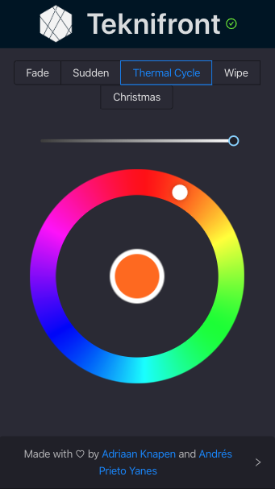

<div align="center">
<p align="center">
  <a href="https://gitlab.com/tekniot/teknifront" rel="noopener">
    
  </a>
</p>

<h3 align="center">TekniFront</h3>
  <a href="https://gitlab.com/tekniot/teknifront/builds">
  
  </a>
  <a href="./LICENCE">
    
  </a>
  <a href="https://codecov.io/gl/tekniot/teknifront">
    
  </a>
  <a href="https://www.repostatus.org/#active">
    
  </a>
  
  <br />
  
  <a href="https://depfu.com/gitlab/tekniot/teknifront?project_id=10536">
    
  </a>
</div>

---

<p align="center"> The frontend of the <a href="https://gitlab.com/tekniot">TekniIoT</a> project.
    <br> 
</p>

## 📝 Table of Contents

- [About](#about)
- [Getting Started](#getting_started)
- [Running the Tests](#tests)
- [Deployment](#deployment)
- [Usage](#usage)
- [Built Using](#built_using)
- [Authors](#authors)
- [Acknowledgments](#acknowledgement)

## 🧐 About <a name = "about"></a>

This is the frontend of the [TeknIoT](https://gitlab.com/tekniot/) project. It can be used to announce state updates of the lights, which will be picked up by the [TekniBridge](https://gitlab.com/tekniot/teknibridge).



## 🏁 Getting Started <a name = "getting_started"></a>

These instructions will get you a copy of the project up and running on your local machine for development and testing purposes. See [deployment](#deployment) for notes on how to deploy the project on a live system.

### Prerequisites

You need to have [Yarn](https://yarnpkg.com/en/docs/install) installed to use this repository.

### Installing

First we need to install all dependencies, run:

```bash
yarn install
```

To start the development environment, run:

```bash
yarn start
```

Open [http://localhost:3000](http://localhost:3000) to view it in the browser.

The page will automatically reload whenever you save any file and display potential compilation errors.

## 🔧 Running the Tests <a name = "tests"></a>

After setting up the development environment, tests can be invoked using:

```bash
yarn test
```

This launches the test runner in the interactive watch mode.<br />
See the section about [running tests](https://facebook.github.io/create-react-app/docs/running-tests) for more information.

## 🎈 Usage <a name="usage"></a>

Execute

```bash
yarn build
```

Which builds the app for production to the `build` folder.<br />
It correctly bundles React in production mode and optimizes the build for the best performance.

The build is minified and the filenames include the hashes.<br />
Your app is ready to be deployed!

See the Create-React-App documentation about [deployment](https://facebook.github.io/create-react-app/docs/deployment) for more information.

## 🚀 Deployment <a name = "deployment"></a>

Deploy the static files to a CDN. We would recommend using continious deployment to automate this process, e.g. by using [Zeit Now](https://zeit.co/now) which shouldn't need any configuration to setup.

### Manually

After setting up the project, create a build:

```bash
yarn build
```

This will emit the project as a static website in the `build/` directory. Deploy these to a CDN or your self-hosted solution for serving static files.

### Docker

There are Docker images available at [Gitlab Container Registry](https://gitlab.com/tekniot/teknifront/container_registry), or you can build them yourself.

For example, the following command exploses the application at port [`http://localhost:3000`](http://localhost:3000).

```bash
docker run --rm --detach --publish 3000:80 --name teknifront registry.gitlab.com/tekniot/teknifront:latest
```

## ⛏️ Built Using <a name = "built_using"></a>

- [React](https://reactjs.org/) - Frontend Framework
- [MQTT](https://mqtt.org/) - Backend Communication Protocol
- [Gitlab](https://gitlab.com) - VCS and Continuous Integration
- [Vercel](https://vercel.com) - CDN and Continuous Deployment

## ✍️ Authors <a name = "authors"></a>

- [Adriaan Knapen](https://aknapen.nl) [](https://gitlab.com/Addono) [](https://github.com/Addono)
- [Andrés Prieto Yanes](https://andrespy.gitlab.io) [](https://gitlab.com/andrespy) [](https://github.com/andrespy)

## 🎉 Acknowledgements <a name = "acknowledgement"></a>

- Thank you React community for all the awesome packages you made!
